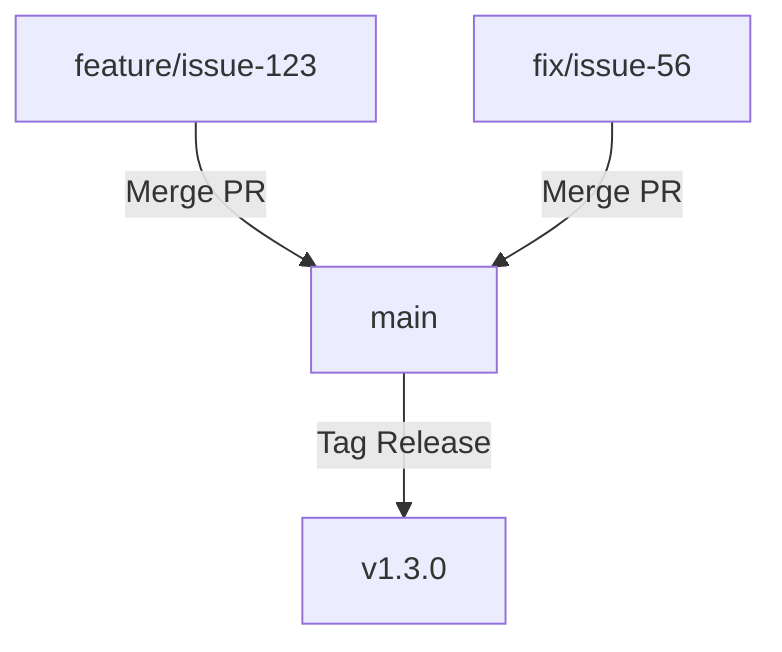

# Rule: Release Workflow & CHANGELOG

Use this guide whenever completing features, fixes, or chores that belong to a milestone. It defines the standards for maintaining the CHANGELOG and working with GitHub Milestones/Releases.

---

## 1. CHANGELOG Format (Keep a Changelog)

The project follows the [Keep a Changelog](https://keepachangelog.com/en/1.1.0/) standard combined with [Semantic Versioning](https://semver.org/).

The `CHANGELOG.md` file lives at the project root.

### Structure

```markdown
# Changelog

All notable changes to this project will be documented in this file.

The format is based on [Keep a Changelog](https://keepachangelog.com/en/1.1.0/),
and this project adheres to [Semantic Versioning](https://semver.org/spec/v2.0.0.html).

## [Unreleased]

### Added

- New features

### Changed

- Changes to existing functionality

### Fixed

- Bug fixes

### Removed

- Removed features

## [1.1.2] - 2026-06-05

### Added

- ...
```

### Category Mapping (Issue Labels → CHANGELOG Sections)

| GitHub Label | CHANGELOG Section                 |
| ------------ | --------------------------------- |
| `feat`       | **Added**                         |
| `fix`        | **Fixed**                         |
| `style`      | **Changed**                       |
| `chore`      | **Changed**                       |
| `docs`       | **Changed**                       |
| `major`      | **Added** (highlight as breaking) |

---

## 2. Workflow: During Development

When completing work on an issue:

1. **Add an entry to `[Unreleased]`** in `CHANGELOG.md` referencing the issue number.
2. Use the format: `- Description of change ([#NN](link-to-issue))`.
3. Place the entry under the correct section (Added/Changed/Fixed/Removed).

Example:

```markdown
### Fixed

- Prevent app state reset when minimizing/restoring windows by hiding instead of unmounting ([#56](https://github.com/GabFiterman/sete-janelas/issues/56))
```

---

## 3. Branching Strategy & Workflow (Trunk-Based / Rolling Release)

The project uses a Trunk-Based Development workflow with micro-releases, optimized for fast and continuous delivery:

- **`main`**: The primary branch representing the current production environment (Vercel deploys `main` automatically).
- **`feature/issue-NN`** or **`fix/issue-NN`**: Temporary branches cut from `main`. Features/fixes are merged directly back into `main` after verification.

### Flow Diagram



---

## 4. Workflow: Cutting a Micro-Release

When a feature branch is ready to be merged and deployed:

1. **Bump the version** in `package.json` on the feature branch (incrementing minor for new features, patch for bugfixes/minor updates, following SemVer).
2. **Move changes from `[Unreleased]` to a new version section** in `CHANGELOG.md` (e.g., `## [X.Y.Z] - YYYY-MM-DD`). Add a fresh empty `[Unreleased]` section.
3. **Commit** these changes on the feature branch with a release message: `chore: release vX.Y.Z`.
4. **Push the feature branch** to origin: `git push origin feature/issue-NN`.
5. **Open a Pull Request** from `feature/issue-NN` to `main` on GitHub:
   - Complete the PR template with description and context.
   - Merge the PR to `main` via the GitHub UI (keeps a historical record of the PR).
6. **Tag the Release**:
   - Checkout to `main` locally and pull the merge: `git checkout main && git pull origin main`.
   - Create a Git tag on `main`: `git tag vX.Y.Z`.
   - Push the tag to GitHub: `git push origin vX.Y.Z`.
7. **Publish GitHub Release**:
   - Go to the GitHub repository page, click on **Releases** and then **Draft a new release**.
   - Select the tag `vX.Y.Z` you just pushed.
   - Title the release `vX.Y.Z` and copy the entries from `CHANGELOG.md` for this version into the description field.
   - Click **Publish release** (this will make it visible on the main page of the repository).
8. **Close the issue** on GitHub.

---

## 5. Commit Messages

Follow Conventional Commits tied to the issue:

```
#<issue_number> <type>: <description>

<optional body>
```

Types: `feat`, `fix`, `chore`, `refactor`, `style`, `docs`, `test`

Example:

```
#56 fix: Hide minimized windows instead of unmounting to preserve app state
```

---

## 6. Branch Naming

```
feature/issue-<number>    # For feat/style issues
fix/issue-<number>        # For fix issues
chore/issue-<number>      # For chore/docs issues
```

---

## 7. Milestone Discipline

- Every issue MUST belong to a milestone before starting work.
- Work progresses milestone by milestone (e.g., v1.2.0 → v1.3.0).
- Don't mix milestone scopes in a single PR unless explicitly agreed.
