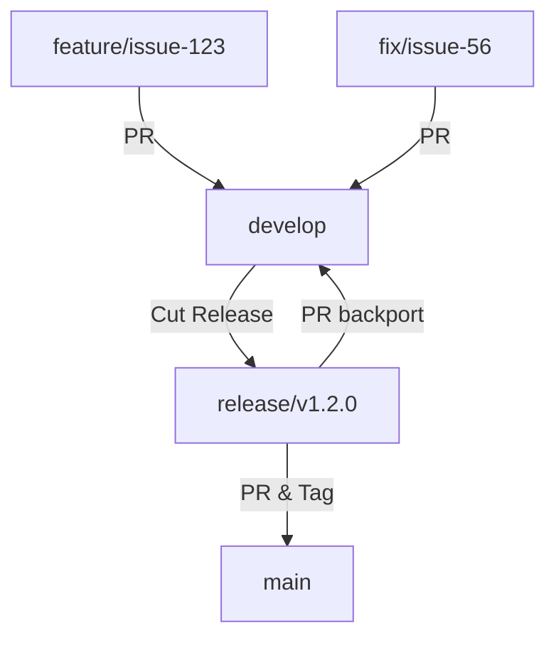

# Rule: Release Workflow & CHANGELOG

Use this guide whenever completing features, fixes, or chores that belong to a milestone. It defines the standards for maintaining the CHANGELOG and working with GitHub Milestones/Releases.

---

## 1. CHANGELOG Format (Keep a Changelog)

The project follows the [Keep a Changelog](https://keepachangelog.com/en/1.1.0/) standard combined with [Semantic Versioning](https://semver.org/).

The `CHANGELOG.md` file lives at the project root.

### Structure

```markdown
# Changelog

All notable changes to this project will be documented in this file.

The format is based on [Keep a Changelog](https://keepachangelog.com/en/1.1.0/),
and this project adheres to [Semantic Versioning](https://semver.org/spec/v2.0.0.html).

## [Unreleased]

### Added

- New features

### Changed

- Changes to existing functionality

### Fixed

- Bug fixes

### Removed

- Removed features

## [1.1.2] - 2026-06-05

### Added

- ...
```

### Category Mapping (Issue Labels → CHANGELOG Sections)

| GitHub Label | CHANGELOG Section                 |
| ------------ | --------------------------------- |
| `feat`       | **Added**                         |
| `fix`        | **Fixed**                         |
| `style`      | **Changed**                       |
| `chore`      | **Changed**                       |
| `docs`       | **Changed**                       |
| `major`      | **Added** (highlight as breaking) |

---

## 2. Workflow: During Development

When completing work on an issue:

1. **Add an entry to `[Unreleased]`** in `CHANGELOG.md` referencing the issue number.
2. Use the format: `- Description of change ([#NN](link-to-issue))`.
3. Place the entry under the correct section (Added/Changed/Fixed/Removed).

Example:

```markdown
### Fixed

- Prevent app state reset when minimizing/restoring windows by hiding instead of unmounting ([#56](https://github.com/GabFiterman/sete-janelas/issues/56))
```

---

## 3. Branching Strategy & Workflow

The project uses a Gitflow-inspired branching strategy tailored for portfolio development:

- **`develop`**: The integration branch where all active development happens. All feature and bugfix branches are merged here.
- **`main`**: The production branch containing stable, tagged releases.
- **`release/vX.Y.Z`**: Temporary branches cut from `develop` when a milestone is complete. Used to finalize version bumps, update the changelog, and perform final build verification.

### Flow Diagram


---

## 4. Workflow: Cutting a Release

When all issues in a milestone are complete and the milestone is ready for release:

1. **Cut the release branch** from `develop`: `git checkout -b release/vX.Y.Z`.
2. **Rename `[Unreleased]` → `[X.Y.Z] - YYYY-MM-DD`** in `CHANGELOG.md`.
3. **Add a fresh `[Unreleased]` section** above it.
4. **Bump the version** in `package.json`.
5. **Commit** with message: `chore: release vX.Y.Z`.
6. **Merge to main and Tag**:
   * Open a PR from `release/vX.Y.Z` to `main`.
   * Once merged, create a Git tag: `git tag vX.Y.Z` on `main`.
   * Create a GitHub Release from the tag, using the CHANGELOG section as release notes.
7. **Merge back to develop**:
   * Open a PR from `release/vX.Y.Z` to `develop` to sync the version bump and changelog.
8. **Close the milestone** on GitHub.

---

## 5. Commit Messages

Follow Conventional Commits tied to the issue:

```
#<issue_number> <type>: <description>

<optional body>
```

Types: `feat`, `fix`, `chore`, `refactor`, `style`, `docs`, `test`

Example:

```
#56 fix: Hide minimized windows instead of unmounting to preserve app state
```

---

## 6. Branch Naming

```
feature/issue-<number>    # For feat/style issues
fix/issue-<number>        # For fix issues
chore/issue-<number>      # For chore/docs issues
```

---

## 7. Milestone Discipline

- Every issue MUST belong to a milestone before starting work.
- Work progresses milestone by milestone (e.g., v1.2.0 → v1.3.0).
- Don't mix milestone scopes in a single PR unless explicitly agreed.
