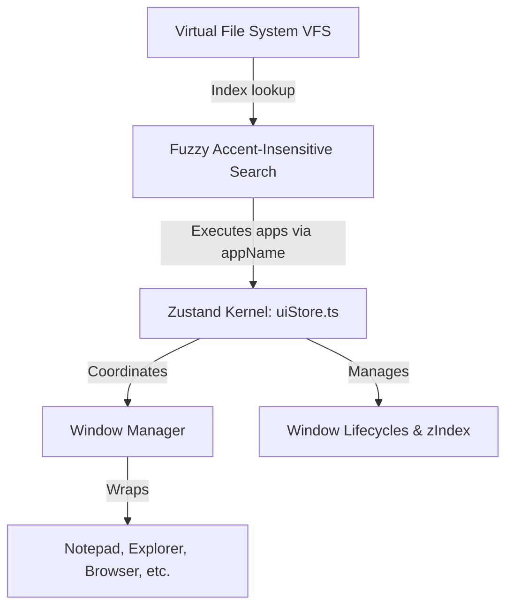

# Sete Janelas - High-Fidelity OS Simulator

This project is a premium Web Operating System simulation built as a high-fidelity portfolio. It replicates the complete visual and interactive behavior of a desktop OS inside the web browser, prioritizing multitasking, drag-and-drop window management, a path-indexed Virtual File System (VFS), and global unified search.

---

## 🛠 Tech Stack

- **Framework:** React 19 (TypeScript)
- **Build System:** Vite
- **Kernel / Global State:** Zustand (`src/store/uiStore.ts`)
- **Animation Engine:** Framer Motion
- **Styles:** Modular SASS/SCSS (Atomic Design pattern)
- **Testing:** Vitest + React Testing Library

---

## 🏛 Core Architecture



### 1. The Zustand Kernel (`src/store/uiStore.ts`)

Acts as the central operational system kernel, maintaining:

- **Window Lifecycles:** Opening, focusing, minimizing, maximizing, closing.
- **Dynamic z-index Layers:** Ensures the active window is always on top (`focusWindow`).
- **System-wide Menus:** Start menu triggers and taskbar state.
- **Viewport Constraints:** Clamping window dimensions and positions to avoid off-screen overflow.

### 2. Virtual File System (VFS)

Located in `src/constants/file-system/`:

- **`ITEMS_MAP_ALL`**: A flat index of all directories, documents, shortcuts, links, and system executables. Keys must be fully normalized uppercase paths (e.g., `C:/SISTEMA_DE_ARQUIVOS`).
- **`STRUCTURE_MAP_FILE_SYSTEM`**: Maps folder keys to arrays of their child files/folders.
- **`searchVFS` Utility**: An instant, accent-insensitive fuzzy lookup helper that handles search queries dynamically.

### 3. Executable Launching (`appName` Bindings)

- Executable files are declared with `extension: '.exe'`, `type: 'file'`, and a specific `appName` string binding.
- Double-clicking or tapping an executable file instantly delegates the launch routine to the Zustand Kernel's `openWindow` action, spawning the correct React application container.

---

## 🎨 Styling & Design Aesthetics

- **Aero Glass Theme:** Built around Windows 7 aesthetics using SCSS variables defined in `src/styles/_variables.scss` (`$aero-glass-base`, `$aero-border`, etc.).
- **Framer Motion:** All window mount/unmount behaviors, maximization transitions, and start menu openings are driven by Framer Motion. Keep transitions smooth (`transition-default` in SCSS).
- **Atomic SASS:** Use `_base.scss` and `_utilities.scss` for layout logic. Avoid inline styles or generic utility classes (like Tailwind) unless integrating deeply with the design system.

---

## 📱 Mobile Adaptation Standards

Sete Janelas features a custom **"Windows 7 Pocket"** layout optimized for touch targets:

- **Maximized Windows**: When `useIsMobile()` returns `true`, all launched application windows are automatically maximized, stripping out resize and drag handles.
- **Touch-Friendly Controls**: Scaling adjustments are made to desktop shortcuts, quick navigation triggers, and context menus.
- **Clean Styles**: Avoid introducing heavy `!important` tags. Use scoped media queries or React conditional classes to preserve code elegance.

---

## 📚 Developer Skill Guides

To assist with standard developer workflows, the following step-by-step interactive procedures are available in `.gemini/skills/`:

1. 📂 **[Adding a New Application](file:///home/dev-fiterman/Projects/Personal/sete-janelas/.gemini/skills/add-new-app.md)**: Standard registry steps in `app-config.ts` and VFS metadata definition.
2. 🗄 **[Managing the Virtual File System (VFS)](file:///home/dev-fiterman/Projects/Personal/sete-janelas/.gemini/skills/manage-vfs.md)**: Guide on configuring directories, folders, shortcuts, and executable files.
3. 🪟 **[Window Manager API](file:///home/dev-fiterman/Projects/Personal/sete-janelas/.gemini/skills/manage-windows.md)**: Master `uiStore.ts` to seamlessly control window lifecycles and positioning.
4. 💅 **[Styling & Animations](file:///home/dev-fiterman/Projects/Personal/sete-janelas/.gemini/skills/styling-and-animations.md)**: Harness the Aero design tokens and Framer Motion components.

---

## 🚀 Building, Running & Testing

### Local Development

```bash
# Install dependencies
npm install

# Run the dev server
npm run dev

# Run unit tests via Vitest
npm run test

# Build production bundle
npm run build
```

### Docker Services

```bash
# Start dev services
make app

# Stop containers
make down
```

---

## 📋 Active Backlog & Epics

- **Epic 1: Window Manager Overhaul (#31)**
  - Redesigning drag/spawn physics; cascade spawn rules; draggable window borders for resizing.
- **Epic 2: Mobile Adaptation (#35, #25)**
  - Transitioning standard workspace elements to the "Windows 7 Pocket" format.
- **Epic 3: Interactive Features (#36)**
  - **MSN Messenger App:** Integrating chatbot assistance.
  - **Adobe Reader App:** Implementing PDF reader support.
- **Epic 4: Native Explorer Refinements (#40) [COMPLETE]**
  - Added new drives, instant-query VFS system search, and the `C:/Sistema de arquivos` executables catalog.
